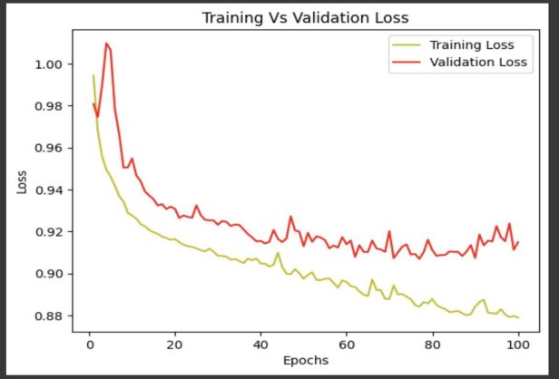
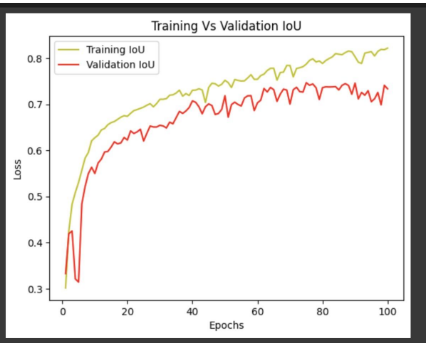
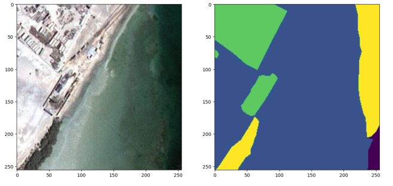
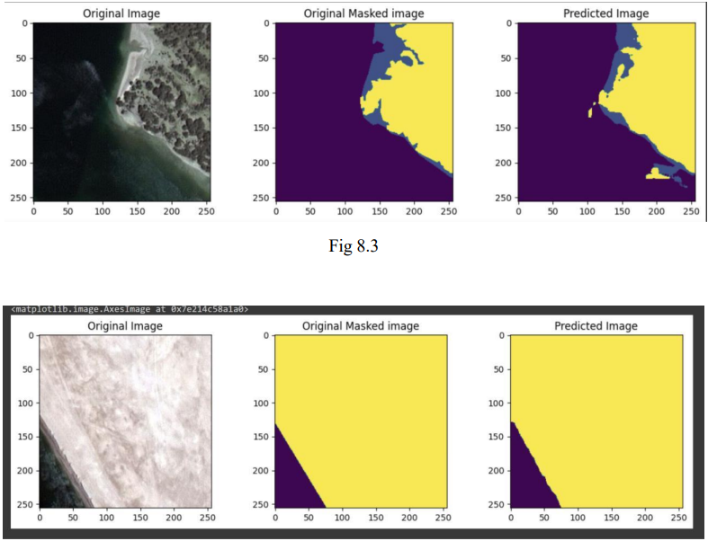

<h1><strong>Aerial Image Classification</strong></h1>
<h3>This project focuses on the development of an advanced aerial image classification system aimed at enhancing remote sensing capabilities. Leveraging machine learning and deep learning techniques, such as Convolutional Neural Networks (CNNs), Support Vector Machines (SVMs), and ensemble methods, the system addresses challenges in varying illumination, weather conditions, and complex land patterns. 

Key features include:
- <strong>Disaster Detection:</strong> The model identifies natural disasters like earthquakes, cyclones, and wildfires using satellite and drone imagery. It classifies images into disaster or normal categories, displaying results with associated probabilities.
- <strong>Techniques and Methods:</strong> Utilizes state-of-the-art deep learning methods, including CNNs and data augmentation, to improve accuracy and robustness.
- <strong>Applications:</strong> Applicable in remote sensing, urban planning, agriculture, disaster management, environmental monitoring, and military intelligence.

The project also explores preprocessing steps, transfer learning, and domain-specific architectures to overcome challenges such as data scarcity and environmental impacts.</h3>

<h1>Hardware Requirements</h1>
<ul>
  <li>Operating System - Windows, macOS, Linux</li>
  <li>RAM 12 GB</li>
  <li>T4 - GPU</li>
  <li>Processor 64-bit</li>
</ul>
<h1>Software Requirements</h1>
<ul>
  <li>Programming Language: Python</li>
  <li>Deep Learning Frameworks: TensorFlow and Keras</li>
  <li>Machine Learning Libraries: Scikit-learn</li>
  <li>Data Visualization Libraries: Matplotlib and Seaborn</li>
  <li>Google Colab</li>
</ul>

<h1>Proposed Design</h1>

<h1>Testing and Results</h1>
<h2>Training vs. Validation Loss</h2>

<h2>Training vs. Validation IoU</h2>

<h3>Output Images</h3>

  
  

<h3>Original Image vs. Masked Image vs. Predicted Image</h3>

<h2>License</h2>
    
This project is licensed under the MIT License - see the <a href="LICENSE">LICENSE</a> file for details.

